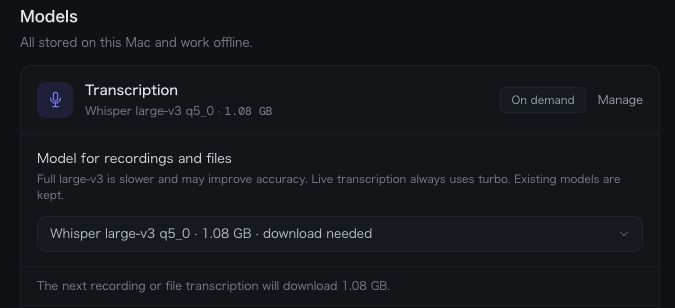
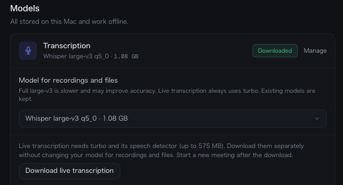

# ADR-0034: Offer full Whisper large-v3 for offline transcription

- Date: 2026-09-05
- Status: Accepted
- Related: [Issue #78](https://github.com/daichi8120/mojiroku/issues/78)

## Decision

Offer full Whisper large-v3 q5_0 in Settings → Models for recordings and imported
files. Turbo remains the default. Live transcription always uses turbo, regardless
of the offline choice. Both use greedy decoding by default (ADR-0033).

The picker displays the model, download size, whether a download is needed, and
the speed tradeoff. Selecting a model saves the choice; its first transcription
downloads it through the existing progress/checksum path. Switching models keeps
existing files. No deletion, automatic model upgrade, or memory-tier promotion is
introduced.



Screenshot: the actual Settings component in an isolated browser preview with
mocked Tauri responses. It demonstrates layout, selection, and the download notice;
model inference was verified separately through the real Rust pipeline.

### Preparing live transcription on a fresh installation

Full-model offline jobs do not download turbo. When turbo or Silero is missing,
Settings shows a separate **Download live transcription** action (up to 575 MB).
It prepares both live models with checksum verification and leaves the offline
selection unchanged. Download/queued progress is shown; errors remain visible and
the action can be retried. The action shares the heavy-job lock with offline jobs
so simultaneous downloads cannot write the same `.part` file.



This is the isolated Settings preview with mocked Tauri responses. The underlying
download helper was tested separately against the real model host from a cache
containing only a placeholder offline model. Both live models were prepared, the
offline file was untouched, and a second call reused the downloaded turbo file.
Run that network regression explicitly:

```bash
cargo test -p mojiroku-core models::tests::prepares_live_models_with_only_full_model_cached -- --ignored --exact
```

Live previews are created when a meeting starts, so a meeting already in progress
must be restarted to use newly downloaded models. Offline transcription never
depends on this optional preparation succeeding.

## Selection and job semantics

`models::WHISPER_MODELS` is the allowlist and metadata source for file names, labels,
sizes, and SHA-256 checksums. Both files use the existing pinned model-host revision
`5359861c739e955e79d9a303bcbc70fb988958b1`. Explicit full-model selection takes
precedence; empty or unknown settings choose turbo, even if full weights are cached.
This differs from summary-model auto-selection: merely having full Whisper weights
on disk must not make the slower model the default.

Persist `Settings.transcription_model` and snapshot the resolved catalog file in
`JobParams.transcription_model` when a job is enqueued. A later Settings change
cannot alter a waiting job. The worker resolves this snapshot and passes one
`TranscriptionOptions` value through STT-only, STT-plus-diarization, and both tracks
of recorded meetings. Existing language hints, progress events, offset correction,
FFI guards, and the heavy-job semaphore remain in their existing paths.

Old settings and queued-job JSON omit the field and deserialize to an empty string,
which resolves to turbo. No SQLite schema migration is needed. Existing core APIs
keep their turbo behavior; new `*_with_options` functions accept an explicit model.
The live engine continues to load `DEFAULT_WHISPER_MODEL` directly.

## Evidence and limitations

The real pipeline downloaded the full model (1,081,140,203 bytes), verified its
SHA-256, and transcribed public FLEURS audio. A serial 40-recording comparison used
the same audio, VAD, normalisation, automatic language detection, and greedy decoder:

| Metric | Turbo | Full large-v3 |
|---|---:|---:|
| Japanese CER | 2.74% | 2.74% |
| English WER | 6.85% | 5.78% |
| Japanese pipeline time | 17.96 s | 28.61 s |
| English pipeline time | 20.73 s | 30.70 s |

[Reproduction commands and scoring details](../../eval/stt/README.md#full-large-v3-comparison)
are in the harness README. These read-speech results justify offering a choice;
they do not establish a default change or quality for long, overlapping, or
mixed-language meetings. Real-use feedback remains the deciding evidence.

Regression checks cover legacy settings/jobs, persisted model choices, queued-job
isolation, allowlist fallback, and keeping model-comparison scores separate even
when both variants use the same decoder.
